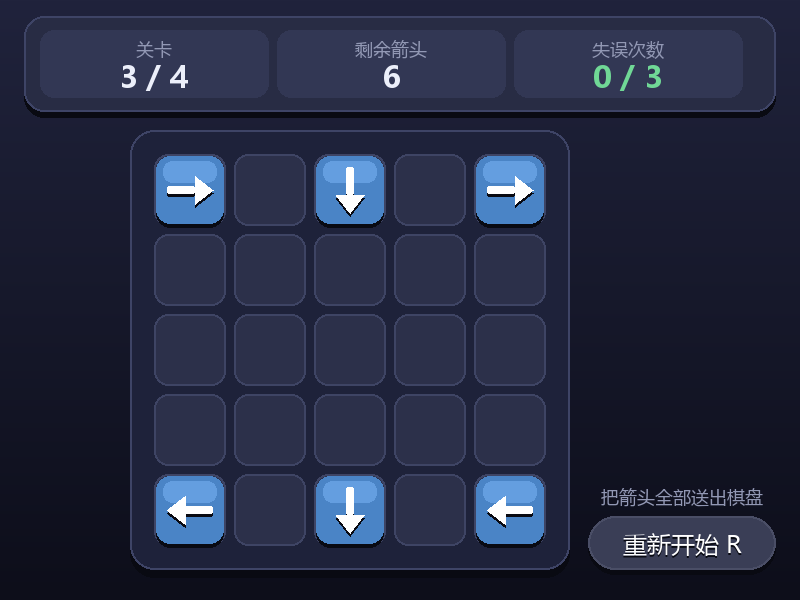

# 用 AIGC 完成「一箭又一箭」小游戏

| 项目 | 内容 |
| :--- | :--- |
| 这个作业属于哪个课程 | <课程链接> |
| 这个作业要求在哪里 | <作业链接> |
| 这个作业的目标 | 使用 Python 和 AIGC 完成"一箭又一箭"小游戏 |
| 学号 | XXXXXXXX |
| GitHub 仓库 | <https://github.com/34zkx/ruangong> |
| 开发环境 | Windows 11 · Python 3.13.13 · pygame 2.6.1 |
| 使用的 AIGC 工具 | Codex（生成代码、排查 Bug、编写测试）、OpenCode（早期版本） |

---

## 一、项目展示

### 开始界面


标题下方是玩法说明卡片，三条规则各占一行，底部是圆角的开始按钮。背景是一层从深蓝紫到近黑的竖直渐变。

### 游戏过程



顶部状态条固定显示三件事：当前关卡、剩余箭头数、失误次数。鼠标停在某个箭头上时，能飞出的箭头会亮成蓝色，前方被挡住、点了会算失误的箭头会变成红色，不用先点错一次才知道能不能点。

### 通关界面


### 失败界面


---

## 二、项目介绍

### 2.1 游戏规则

棋盘是 5×5 的网格，每格最多放一个箭头，箭头有上下左右四种朝向。玩家依次点击箭头：

- 沿箭头方向、到棋盘边界之间**没有**其他箭头，箭头就沿方向飞出棋盘并消失；
- 中途**有**箭头挡住，箭头不会消失，而是原地晃动并变红，同时消耗一次失误机会；
- 清空棋盘上的全部箭头，本关通关，可以进入下一关；
- 失误次数耗尽，本关失败，可以重新开始。

游戏一共 4 关，难度靠箭头数量和相互阻挡的链条长度递增。

### 2.2 界面设计

窗口固定 800×600，画面分成三块：顶部状态条、中央棋盘、右下角的重新开始按钮。

配色上用了深蓝紫的渐变背景托底，卡片和棋盘各自带一点投影和描边，视觉上分出层次；强调色是琥珀色，用来标标题和关键提示；状态色只有两种语义——绿色表示安全（失误次数为 0）、红色表示警告（已经失误、或者这个箭头点了会失误）。字体统一用微软雅黑，标题走粗体字重，和正文拉开层级。

### 2.3 主要功能

| 作业要求 | 实现方式 |
| :--- | :--- |
| 图形化游戏界面 | pygame 窗口，60 帧刷新，鼠标点击交互 |
| 四种方向的箭头 | `Direction` 枚举 + 用多边形绘制的箭头图形 |
| 鼠标点击选择箭头 | `handle_click()` 里用矩形碰撞检测判断点中了哪个箭头 |
| 判断前方是否有阻挡 | `can_remove_arrow()` 沿箭头方向逐格扫描 |
| 无阻挡时飞出并消失 | 进入飞出状态，滑出窗口后 `alive = False` |
| 有阻挡时的碰撞反馈 | 箭头左右晃动 + 变红 + 失误次数加一 |
| 显示失误次数 | 顶部状态条中，失误次数是三项里唯一会变色的 |
| 至少 3 个可通关关卡 | 4 个关卡，并用自动测试逐一验证存在通关顺序 |
| 通关结果与进入下一关 | 通关卡片 + 空格键进入下一关 |
| 失败结果 | 失败卡片 + R 键重试本关 |
| 重新开始功能 | 右下角按钮，或按 R 键 |

界面部分作业要求至少包含开始界面、游戏界面、通关/失败界面，三个都有，并且游戏界面按要求显示了当前关卡、棋盘、剩余箭头数、失误次数和重新开始按钮。

### 2.4 自己额外做的几件事

**箭头不用字符画。** 一开始箭头是直接用 `▲▼◀▶` 这四个字符渲染的，后来发现这类符号在中文字体里不一定有字形，干脆改成用 `pygame.draw.polygon` 和圆角矩形拼出"箭杆 + 箭头"的形状，四个方向共用一套局部坐标再旋转，不依赖任何字体。

**中文不再出现方框。** 程序启动时会在系统里找一个真的包含中文字形的字体（Windows 下优先微软雅黑，另有 macOS / Linux 的常见路径），并且逐字验证字形存在，验证不过就换下一个候选。

**自动测试。** 写了一个 `test_game.py`，覆盖作业要求的 T01~T06，另外加上了飞行动画、关卡可通关性、界面布局等检查，共 10 项，可以在没有显示器的环境下运行。

---

## 三、实现思路

### 3.1 箭头、方向和关卡怎么表示

方向用枚举表示，同时为四个方向准备统一的单位向量。这个向量表是路径检测和飞行动画共用的，避免出现"判定说能飞、动画却往旁边走"的不一致。

```python
class Direction(Enum):
    UP, DOWN, LEFT, RIGHT = 1, 2, 3, 4

DIRECTION_VECTORS = {
    Direction.UP: (0, -1), Direction.DOWN: (0, 1),
    Direction.LEFT: (-1, 0), Direction.RIGHT: (1, 0),
}
```

关卡直接写成二维数组，0 表示空格，1~4 表示朝上/下/左/右的箭头，`load_level()` 再把非零格子转成 `Arrow` 对象，这样加关卡只需要往 `LEVELS` 里加一组数字。

```python
Level([
    [4, 0, 2, 0, 4],
    [0, 0, 0, 0, 0],
    [3, 0, 0, 0, 1],
    [0, 0, 0, 0, 0],
    [3, 0, 2, 0, 3],
], 3)
```

每个箭头是一个 `Arrow` 对象，记录自己所在的行列、朝向，以及存活、正在飞出、正在晃动等状态。因为箭头的行和列从创建后就不再变化，位置是算出来的（格子中心 + 飞行偏移），所以动画不需要记录一堆坐标。

### 3.2 路径检测（核心逻辑）

判定规则是：只看箭头正前方的同一行或同一列，只要存在任何一个还留在棋盘上的箭头，就算被挡住。所以检测就是按方向一格一格往前走，走到棋盘边界为止。

```python
def can_remove_arrow(self, arrow: Arrow) -> bool:
    level = LEVELS[self.current_level]
    if arrow.direction == Direction.RIGHT:
        for col in range(arrow.col + 1, level.cols):          # 只走到最后一列
            for a in self.arrows:
                if a.alive and not a.flying and a.row == arrow.row and a.col == col:
                    return False
        return True
    # 其余三个方向同理，只是扫描范围相反
```

这里有两个容易被忽略的边界问题：

一是**越界**。`range(arrow.col + 1, level.cols)` 这种写法让循环天然停在棋盘边界上，不会访问到棋盘外的格子。反过来，朝左的箭头用 `range(arrow.col - 1, -1, -1)`，当 `arrow.col == 0` 时这个 range 直接是空的，循环体一次都不执行，函数返回 `True`——也就是"贴着左边框、朝左的箭头一定能飞出去"，这正好是第 3 项测试要验证的情况。

二是**正在飞出的箭头不算阻挡**。箭头点中之后不会立刻消失，而是有一段飞行动画，这期间它的 `alive` 还是 `True`。如果检测时不排除它，就会出现"我已经点掉了挡路的箭头，但后面的箭头还是点不动"的怪现象。所以条件里加了 `not a.flying`，位置动画归动画，逻辑上它已经离开棋盘了。

还有一个性质值得记一下：**消除箭头只会让更多箭头变得可以消除，永远不会反过来堵住别人**。因为棋盘上的箭头只会减少、不会增加，一个箭头能飞出说明它到边界的格子都是空的，清掉别的箭头不会把空格重新填上。这个单调性意味着：只要不断点击当前能飞出的箭头，最后一定能把棋盘清空——除非关卡本身设计得无解。第 9 项测试就是靠这个性质写了一个贪心验证，逐关点一遍确认能清空，避免出现"关卡实际上无法通关"这种致命问题。

### 3.3 飞出动画

箭头对象里有三个和飞行有关的状态：`flying` 表示是否正在飞、`fly_offset` 表示已经飞出去多远（像素）、`FLY_SPEED` 是每帧移动的距离。

```python
FLY_SPEED = 18   # 像素/帧，60 帧下约 1080 像素/秒

def get_position(self):
    dx, dy = DIRECTION_VECTORS[self.direction]
    x = self.col * CELL_SIZE + BOARD_OFFSET_X + CELL_SIZE // 2 + dx * self.fly_offset
    y = self.row * CELL_SIZE + BOARD_OFFSET_Y + CELL_SIZE // 2 + dy * self.fly_offset
    return int(x), int(y)

def update(self):
    if self.flying:
        self.fly_offset += self.FLY_SPEED
        x, y = self.get_position()
        if not (-CELL_SIZE < x < WINDOW_WIDTH + CELL_SIZE
                and -CELL_SIZE < y < WINDOW_HEIGHT + CELL_SIZE):
            self.flying = False
            self.alive = False        # 完全飞出窗口才真正消失
```

位置不是存起来的，而是每帧用"格子中心 + 方向向量 × 偏移量"算出来，所以四个方向共用同一套代码，只有向量不同。飞出时间跟距离有关：贴着边缘朝外的箭头大约 0.2 秒就出界了，从最左侧一路飞出去的箭头大约 0.6 秒。

### 3.4 通关判定的时机

这里踩了一个坑。最初通关判定写在鼠标点击的处理函数里：点掉最后一个箭头后立刻把状态切到"通关"。加上飞出动画之后，问题就暴露了——状态一切换，画面马上变成通关卡片，最后那支箭的动画刚开始就被顶掉了，看起来仍然是"瞬间消失"。

解决办法是把判定挪到每帧的绘制流程里：

```python
for arrow in self.arrows:
    arrow.update()
    arrow.draw(self.screen, ...)

# 最后一个箭头完全飞出棋盘后才算通关，这样动画能播完
if self.check_level_complete():
    self.state = GameState.LEVEL_COMPLETE
```

这样一来，通关这张卡片出现的时间点，正好是最后一支箭飞出窗口的那一帧。

---

## 四、AIGC 使用过程

### 4.1 总览

| 子任务 | 借助何种 AIGC 技术 | AI 实现或提供了什么 | 效果如何 | 人工修改 |
| :--- | :--- | :--- | :--- | :--- |
| 整体框架 | Codex | 生成方向枚举、箭头类、关卡类、游戏主循环和 4 组关卡数据 | 程序能跑起来，但界面文字全是方框 | 重新设计了字体加载方案 |
| 中文显示 | Codex | 定位到 `pygame.font.Font(None, ...)` 默认字体不含中文字形，给出系统字体探测代码 | 中文正常显示 | 加了逐字字形校验与跨平台字体候选 |
| 箭头图标 | Codex | 把字符箭头改成多边形绘制，再做成一整支带箭杆的箭头 | 任意系统都能显示，样式统一 | 自己调了箭杆长度、箭头宽度的比例 |
| 飞出动画 | Codex | 用原来没用上的 `animating` 等字段改造成飞出状态机 | 点击后箭头滑出棋盘，观感明显变好 | 把通关判定从点击处挪到绘制循环，解决动画被顶掉的问题 |
| 界面美化 | Codex | 给出调色板、渐变背景、卡片/状态条/悬停高亮的实现 | 界面从"能看"变成"好看" | 自己定了配色和每块区域的信息层级 |
| 自动测试 | Codex | 生成覆盖 T01~T06 的测试脚本，并额外验证动画与关卡可通关性 | 10 项全部通过 | 修掉了我自己写错的一条断言 |

### 4.2 过程一：中文全是方框

程序第一次跑起来，界面能显示、按钮能点、箭头能消除，但所有文字都变成了一个个空心方框，连标题"一箭又一箭"都看不清。

我给 AI 的描述是："游戏运行时没有文字只有方框"。它给出的结论是：代码里四处字体都是 `pygame.font.Font(None, 64)` 这种写法，`None` 会让 pygame 使用内置的默认字体 FreeSans，而这个字体只有拉丁字形，没有任何汉字，于是每个汉字都渲染成"缺字形方框"；箭头用的 `▲▼◀▶` 也是同样的原因。

修复方案不是简单换一个字体文件路径，而是做成了可移植的加载逻辑：先按常见安装路径找（微软雅黑、黑体、思源黑体、Noto、macOS 的苹方、Linux 的文泉驿等），再到系统字体库里按名字匹配，**并且逐字验证**——用 `font.metrics()` 检查界面文案里出现过的每个汉字是否都有字形，缺一个就换下一个候选。这样才能避免"字体文件打开了但依然缺字形"的隐蔽情况。

实际效果：中文和箭头都正常显示了。

我的修改：把校验字符集从最初的 69 个字符，在改完界面文案之后重新提取成 104 个字符，保证校验范围跟着文案更新，不会出现"校验通过但新加的文案是方框"。

### 4.3 过程二：箭头从字符改成图形

箭头最初是用 `▲▼◀▶` 字符渲染的。虽然换上中文字体后能显示，但我发现这类几何符号在不同字体里的粗细、大小差别很大，而且换到别的电脑上如果找不到合适的字体，又会退回方框。

我的要求是"把箭头的图标改成带箭柄的，像这样 ->"。AI 给出的做法是：先在"箭头朝右"的局部坐标里定义好三角形的三个顶点和箭杆矩形，再用一个 `place()` 函数做 90 度的旋转和平移，四个方向共用同一组数值。

```python
def place(x, y):
    if self.direction == Direction.UP:     x, y = y, -x
    elif self.direction == Direction.DOWN: x, y = -y, x
    elif self.direction == Direction.LEFT: x, y = -x, -y
    return cx + x, cy + y                  # 平移到格子中心
```

实际效果：四个方向的箭头形状完全一致，只靠旋转区分，也不再有字体依赖。

我的修改：调了箭杆宽度（8 像素）、箭头底宽（28 像素）和整支箭的长度（46 像素），让它在 80 像素的格子里居中、四周留白均匀。另外我一开始的写法是四个方向各写一套顶点，被 AI 建议改成局部坐标 + 旋转，代码短了一半。

### 4.4 过程三：飞出动画和它的时序问题

作业要求"箭头成功飞出和发生碰撞时，应有基本的动画或视觉反馈"。碰撞反馈原本就有（晃动加变色），但成功飞出只是让箭头瞬间消失。

我提出的要求是"增加飞出时的动画"。AI 的做法是把 `Arrow` 里三个从来没被用过的字段（`animating`、`anim_progress`、`anim_speed`）改造成真正的状态机，用 `flying` 和 `fly_offset` 记录飞行状态，每帧推进 18 像素，等箭头完全离开窗口才把 `alive` 置为 `False`。

加上动画之后出现了一个新问题：点掉最后一个箭头时，通关判定立刻生效，画面马上切到通关卡片，最后那支箭的动画只播了一帧就被覆盖了，"动画感"完全没有出来。这是我在测试时发现的——因为我在测试用例里断言的是"箭头进入飞出状态"，而它确实进入了，但玩家实际看不到。

我的修改：把通关判定从鼠标点击处理函数挪到每帧的绘制流程末尾（见 3.4 节），让"通关卡片出现的时刻"和"最后一支箭飞出窗口的时刻"对齐。

### 4.5 过程四：自动测试，包括我自己写错的断言

作业要求记录 T01~T06 六项测试。我让 AI 把这些测试写成一个不需要显示器的脚本，用 SDL 的 dummy 驱动在后台跑，另外加上飞行动画、飞出中的箭头规则、关卡可通关性和界面布局的检查。

第一次运行的结果是 9 项通过、1 项失败，失败的是"飞出中的箭头不再挡路"这一条。查下来是**我的断言写错了**：我挑的那对箭头，除了被正在飞出的箭头挡住之外，同一行里还有另一个箭头也在挡路，所以"后面的箭头变可点"这个条件本来就不该成立。这是测试用例的问题，不是游戏逻辑的问题，改成只验证"正在飞出的箭头不再阻挡它挡过的那一个"之后就通过了。

最终结果是 10 项全部通过：

```text
T01 点击前方无阻挡的箭头 -> 通过 箭头飞出后消失
T02 点击前方有阻挡的箭头 -> 通过 箭头保留，失误 1
T03 点击边缘且朝向棋盘外的箭头 -> 通过 正常飞出，无越界异常
T04 消除本关全部箭头 -> 通过 显示通关并进入下一关
T05 失误次数耗尽 -> 通过 显示失败并允许重新开始
T06 游戏进行中重新开始 -> 通过 布局和失误次数恢复
T07 飞出动画 -> 通过 位置 190 -> 280，飞出窗口后才消失
T08 飞出中的箭头 -> 通过 不再挡路、也点不到
T09 全部 4 个关卡都存在通关顺序 -> 通过 逐关贪心点击验证
T10 界面布局 -> 通过 开始按钮、状态条、棋盘、结果卡片都在窗口内且互不重叠
```

### 4.6 过程五：界面美化

最初版本的界面是清一色的平铺色块：纯色背景、直角矩形按钮、四行白色文字叠在左上角。

我提出的要求是"美化字体与游戏界面"，并明确不想引入新的依赖。AI 的做法是：定义一整套配色常量、把纯色背景换成启动时生成一次的竖直渐变、抽出三个绘图小工具（画卡片、画带投影的文字、画悬停变亮的按钮），然后把五个界面统一改成卡片式布局。

其中最有用的一个改动是**悬停提示**：鼠标移到箭头上时，能飞出的高亮成蓝色，会被挡住的变成红色。这个改动其实降低了游戏难度，但它把"这个箭头能不能点"这条信息提前告诉了玩家，比让玩家靠试错去记要友好。我保留了它，同时它也让"路径检测"这个核心逻辑在界面上变得可见——随便移动鼠标就能看出程序判断的结果和我的直觉一不一致，调试期间很有用。

---

## 五、测试结果

测试方式：手工试玩 + 自动测试脚本。自动测试运行 `python test_game.py`，不需要显示器，直接输出每一项的通过情况。

| 编号 | 测试内容 | 预期结果 | 实际结果 | 是否通过 |
| :--- | :--- | :--- | :--- | :--- |
| T01 | 点击前方无阻挡的箭头 | 箭头飞出棋盘并消失 | 点击后进入飞出状态，滑出窗口后消失 | 通过 |
| T02 | 点击前方有阻挡的箭头 | 箭头不消失，失误次数减 1 | 箭头保留并晃动，失误次数 0 → 1 | 通过 |
| T03 | 点击位于边缘且朝向棋盘外的箭头 | 箭头正常消失，不发生越界错误 | 第 4 关第 3 行第 1 列朝左的箭头正常飞出，无异常 | 通过 |
| T04 | 消除本关全部箭头 | 显示通关并进入下一关 | 状态变为通关，加载第 2 关成功 | 通过 |
| T05 | 失误次数耗尽 | 显示失败并允许重新开始 | 状态变为失败，重新开始后失误次数归零 | 通过 |
| T06 | 游戏进行中重新开始 | 箭头布局和失误次数恢复 | 第 3 关的 6 个箭头全部复位，失误次数归零 | 通过 |
| T07 | 飞出动画（附加） | 位置沿箭头方向连续移动，完全出界后才消失 | 坐标 190 → 280，同一帧内 `alive` 仍为真 | 通过 |
| T08 | 飞出中的箭头规则（附加） | 不再阻挡其他箭头，也不能被再次点击 | 后方的箭头立即可点，重复点击不扣失误 | 通过 |
| T09 | 4 个关卡的可通关性（附加） | 每关都存在通关顺序 | 4 关全部清空 | 通过 |
| T10 | 界面布局（附加） | 各面板和按钮都在窗口内且互不重叠 | 开始按钮、状态条、棋盘、结果卡片位置正确 | 通过 |

自动测试之外，4 个关卡我也逐关实际点通过一遍，确认存在合理的通关顺序，例如：

```text
关卡 1（2 个箭头）：第1行第1列→ -> 第4行第5列←
关卡 2（4 个箭头）：第1行第1列→ -> 第4行第2列↑ -> 第5行第5列← -> 第2行第5列↓
关卡 3（6 个箭头）：第1行第5列→ -> 第5行第1列← -> 第5行第3列↓ -> 第1行第3列↓
                     -> 第1行第1列→ -> 第5行第5列←
关卡 4（8 个箭头）：第1行第5列→ -> 第3行第1列← -> 第3行第5列↑ -> 第5行第1列←
                     -> 第5行第3列↓ -> 第1行第3列↓ -> 第1行第1列→ -> 第5行第5列←
```

---

## 六、PSP 表格

| 任务 | 预估耗时（小时） | 实际耗时（小时） | 差异（小时） |
| :--- | ---: | ---: | ---: |
| 需求分析与游戏设计 | 1.0 | 1.0 | 0 |
| Python 与图形库学习 | 2.0 | 1.5 | -0.5 |
| 游戏界面实现 | 3.0 | 4.0 | +1.0 |
| 路径与碰撞逻辑实现 | 2.0 | 1.5 | -0.5 |
| 关卡设计 | 1.0 | 0.5 | -0.5 |
| AIGC 辅助开发 | 2.0 | 3.5 | +1.5 |
| 测试与修改 | 1.0 | 2.5 | +1.5 |
| README 与博客撰写 | 1.5 | 2.0 | +0.5 |
| **合计** | **13.5** | **16.5** | **+3.0** |

---

## 七、心得体会

**AI 能很快写出"能跑"的程序，但"能跑"和"能用"之间还有一段路。** 这个游戏的第一版几乎是 AI 一口气生成的，逻辑结构、关卡数据、动画骨架都齐了，我第一次运行也确实看到窗口弹了出来——然后满屏都是方框。这个问题的根源不在游戏逻辑，而在 `pygame.font.Font(None, ...)` 这个看起来最不起眼的参数上：它让 pygame 用内置字体，而内置字体没有汉字。这件事让我意识到，AI 写的代码经常在"它没意识到的地方"埋着问题，尤其是和运行环境、字符编码、字体这类跨平台相关的地方。

**AI 会留下"看起来已经写好了"的死代码。** 第一版里有 `animating`、`anim_progress`、`anim_speed` 三个字段，名字看起来就是为动画准备的，但全篇没有任何地方读它们——点击箭头是直接 `alive = False` 让它消失的。也就是说 AI 生成了动画的"接口"，却没有把动画接上去。类似地，`restart_button` 这个矩形也早就定义好了，但从来没有被绘制过。这提醒我：读 AI 给的代码时，不能只看它有没有定义某个东西，要看这个东西有没有被真正用起来。

**动画和状态机的时序，是 AI 容易忽略的地方。** 加上飞出动画之后，"最后一个箭头飞出去"和"切换到通关界面"这两件事发生了冲突：状态一切换，动画立刻被顶掉，玩家看到的还是瞬间消失。这个问题不是 AI 主动发现的，是我把"通关判定放在哪里"重新想了一遍才解决——判定必须发生在动画结束之后，而不是在点击的那一刻。这让我体会到，逻辑正确和体验正确是两件事，AI 通常能保证前者。

**测试的价值在于它会反过来质疑我自己。** 写自动测试的时候，我有一个用例第一次没通过，一开始我以为又是游戏逻辑的问题，查下来是**我的断言写错了**——我挑的那对箭头，同一行里还有第三个箭头在挡路，所以"后面的箭头应该变可点"这个前提本身就不成立。这让我明白，测试代码和业务代码一样需要被推敲，而"测试通过"这件事只有在断言本身正确的前提下才有意义。另外一个收获是关卡可通关性的验证：因为消除箭头具有单调性（消掉一个箭头只会让更多箭头变得可点），我可以用贪心的方法逐关点一遍来证明每关都能通关，而不是靠"我玩过一遍好像是通的"这种印象。

**关于 AIGC 的定位，我的结论是"加速器 + 陪练"。** 让我从零手写这些代码，大概要花两三倍的时间，而且大概率会卡在 pygame 的字体和绘图细节上。AI 帮我把这些"查文档就能解决"的部分快速补上，让我能把精力放在真正需要判断的地方：路径检测的边界条件、动画和状态切换的顺序、关卡是否真的可解、界面信息怎么组织。它也像陪练——我提出的每一个修改要求，都逼着我先想清楚"我到底想要什么效果"，很多时候描述清楚需求的时候，问题本身就解决了一半。

总的来说，这次作业我最大的收获不是学会用 pygame，而是学会了怎么和 AI 一起写代码：让它生成初版，然后带着怀疑去读它写的东西，把运行环境、边界条件、状态时序这些它会漏掉的地方一个个补上，最后用测试把结论固定下来。
